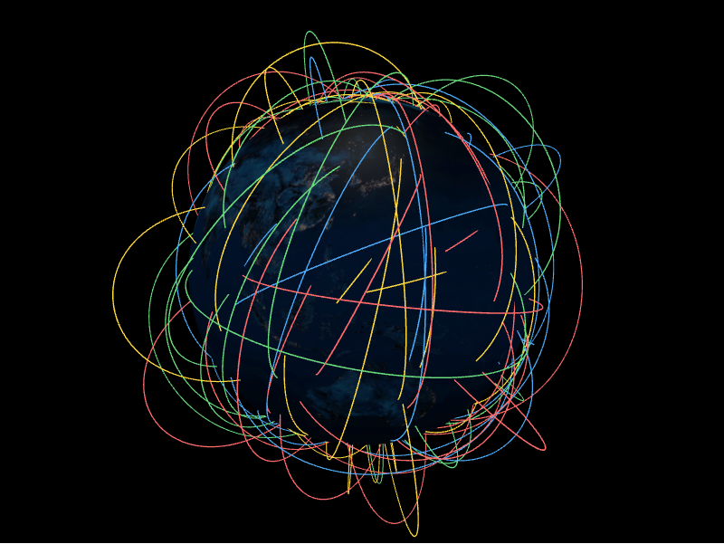

# Arcs Layer



The arcs layer draws great-circle arcs between two coordinates, lifted off the
surface by `altitude`. Each arc is an `ArcDatum`.

```python
from IPython.display import display

from pyglobegl import (
    ArcDatum,
    ArcsLayerConfig,
    GlobeConfig,
    GlobeLayerConfig,
    GlobeWidget,
)

arcs = [
    ArcDatum(
        start_lat=0,
        start_lng=-30,
        end_lat=10,
        end_lng=40,
        altitude=0.2,
        color="#ffcc00",
        stroke=1.2,
    ),
    ArcDatum(
        start_lat=20,
        start_lng=10,
        end_lat=-10,
        end_lng=-50,
        altitude=0.1,
        color="#ffcc00",
        stroke=1.2,
    ),
]

config = GlobeConfig(
    globe=GlobeLayerConfig(
        globe_image_url="https://cdn.jsdelivr.net/npm/three-globe/example/img/earth-day.jpg"
    ),
    arcs=ArcsLayerConfig(arcs_data=arcs),
)

display(GlobeWidget(config=config))
```

## `ArcDatum`

An arc is defined by its endpoints (`start_lat`, `start_lng`, `end_lat`,
`end_lng`) plus appearance fields such as `altitude`, `color`, and `stroke`.

## Custom gradient

`ArcDatum.color` is a single colour or a list of discrete stops. For a continuous
gradient *along* each arc, set a layer-level `arc_color_fn` &mdash; a
[frontend Python callback](../guides/frontend-callbacks.md) mapping a position `t`
in `[0, 1]` (0 at the start, 1 at the end) to a CSS colour string. When set it
overrides the per-datum colour for every arc, and globe.gl samples it at
data-change time (not per animation frame).

The callback signature is the exported `ColorInterpolator` alias; annotate your
function against it so your editor can check it where you pass it.

```python
from pyglobegl import ColorInterpolator, frontend_python


@frontend_python
def gradient(t: float) -> str:  # ColorInterpolator: (t in [0, 1]) -> CSS colour
    red = int(255 * (1 - t))
    return f"rgb({red},30,{int(255 * t)})"


config = GlobeConfig(arcs=ArcsLayerConfig(arcs_data=arcs, arc_color_fn=gradient))
```

Pass `None` (the default) to keep per-datum colours, or swap it at runtime with
`GlobeWidget.set_arcs_color_fn(...)`.

!!! tip "From a GeoDataFrame"

    `arcs_from_gdf` expects point geometry columns named `start` and `end`
    (override with `start_geometry=` / `end_geometry=`). See
    [GeoPandas helpers](../integrations/geopandas.md).
