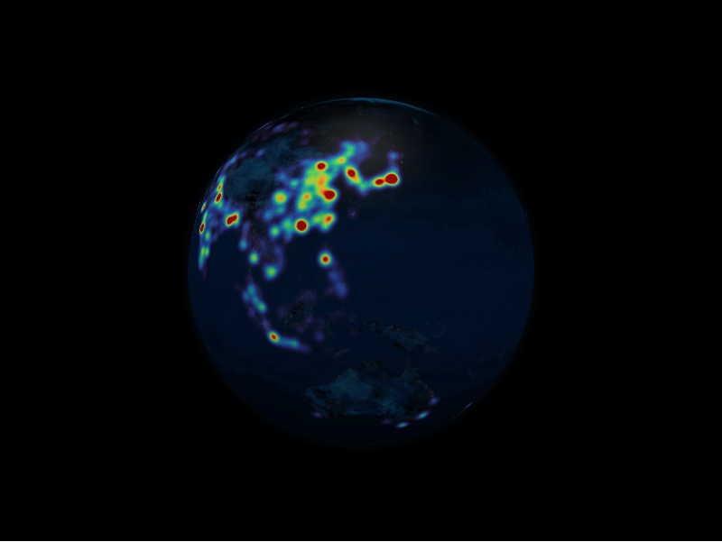

# Heatmaps Layer



The heatmaps layer renders weighted density fields over the surface. Each
`HeatmapDatum` holds a collection of `HeatmapPointDatum` samples plus bandwidth
and colour controls.

```python
from IPython.display import display

from pyglobegl import (
    GlobeConfig,
    GlobeWidget,
    HeatmapDatum,
    HeatmapPointDatum,
    HeatmapsLayerConfig,
)

heatmap = HeatmapDatum(
    points=[
        HeatmapPointDatum(lat=0, lng=0, weight=1.0),
        HeatmapPointDatum(lat=10, lng=10, weight=0.6),
    ],
    bandwidth=0.8,
    color_saturation=2.5,
)

config = GlobeConfig(heatmaps=HeatmapsLayerConfig(heatmaps_data=[heatmap]))

display(GlobeWidget(config=config))
```

## `HeatmapDatum` and `HeatmapPointDatum`

- `HeatmapPointDatum` &mdash; one sample with `lat`, `lng`, and `weight`.
- `HeatmapDatum` &mdash; a group of points plus `bandwidth` (kernel width) and
  `color_saturation` controlling how intensity maps to colour.

## Custom colormap

By default the layer uses globe.gl's built-in colormap. To control it, pass a
`heatmap_color_fn` &mdash; a [frontend Python callback](../guides/frontend-callbacks.md)
that maps a normalised density `t` in `[0, 1]` (0 is the lowest weight, 1 the
peak) to a CSS colour string. globe.gl samples it at data-change time to bake the
colour lookup, so it is not called per animation frame.

```python
from pyglobegl import frontend_python


@frontend_python
def colormap(t):
    red = int(255 * t)
    return f"rgb({red},{int(90 * t)},{255 - red})"


config = GlobeConfig(
    heatmaps=HeatmapsLayerConfig(heatmaps_data=[heatmap], heatmap_color_fn=colormap)
)
```

Leave `heatmap_color_fn` as `None` (the default) to keep globe.gl's colormap. You
can also swap it at runtime with `GlobeWidget.set_heatmaps_color_fn(...)`, and
passing `None` restores the default.

!!! tip "From a GeoDataFrame"

    `heatmaps_from_gdf` builds heatmap points from point geometries with a
    `weight_column`. See [GeoPandas helpers](../integrations/geopandas.md).
