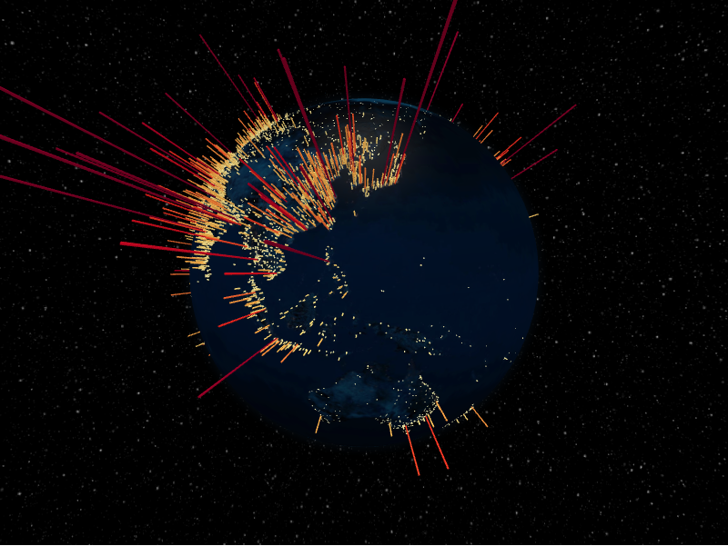

# Hex Bin Layer



The hex bin layer aggregates points into H3 hexagonal bins and extrudes each bin.
You feed it `HexBinPointDatum` rows and shape the bins with accessors. Unlike the
typed-field layers, several hex-bin accessors accept
[`@frontend_python`](../guides/frontend-callbacks.md) callbacks that run in the
browser, so you can compute altitude, colour, and labels from each bin without
writing JavaScript.

```python
from IPython.display import display

from pyglobegl import (
    GlobeConfig,
    GlobeWidget,
    HexBinLayerConfig,
    HexBinPointDatum,
    frontend_python,
)


@frontend_python
def hex_altitude(hexbin):
    return hexbin["sumWeight"] * 0.01


@frontend_python
def point_weight(point):
    # point is an individual input row from hex_bin_points_data
    return point["weight"] * 2.0


@frontend_python
def hex_color(hexbin):
    return "#ff5500" if hexbin["sumWeight"] > 2 else "#66ccff"


@frontend_python
def hex_label(hexbin):
    return f"<b>{len(hexbin['points'])}</b> points in this hex bin"


points = [
    HexBinPointDatum(lat=0, lng=0, weight=1.0),
    HexBinPointDatum(lat=12, lng=15, weight=3.5),
]

config = GlobeConfig(
    hex_bin=HexBinLayerConfig(
        hex_bin_points_data=points,
        hex_bin_point_weight=point_weight,
        hex_altitude=hex_altitude,
        hex_top_color=hex_color,
        hex_side_color=hex_color,
        hex_label=hex_label,
    )
)

display(GlobeWidget(config=config))
```

## Callback I/O

Frontend callback arguments are normalised to plain Python values (dict / list /
str / float / bool / None) when they are JSON-serializable, so dict methods like
`.get(...)` work inside callbacks such as `hex_label`.

| Accessor | Argument | Returns |
| --- | --- | --- |
| `hex_bin_point_lat(point)` | one row from `hex_bin_points_data` | `float` |
| `hex_bin_point_lng(point)` | one row from `hex_bin_points_data` | `float` |
| `hex_bin_point_weight(point)` | one row from `hex_bin_points_data` | `float` |
| `hex_top_color(hexbin)` | aggregated bin | CSS colour `str` |
| `hex_side_color(hexbin)` | aggregated bin | CSS colour `str` |
| `hex_altitude(hexbin)` | aggregated bin | non-negative `float` (globe-radius units) |
| `hex_label(hexbin)` | aggregated bin | HTML/text tooltip `str` |

The `hexbin` argument has the shape:

```python
{"h3Idx": str, "points": list[dict], "sumWeight": float}
```

!!! tip "Prefer defensive access"

    For compatibility across upstream changes, read bin fields defensively (for
    example `hexbin.get("sumWeight", 0)`) in case keys are missing or change shape.

`hex_margin`, `hex_bin_point_lat`, `hex_bin_point_lng`, and `hex_bin_point_weight`
also accept `@frontend_python` callbacks when you need frontend-computed accessors.

!!! note "From a GeoDataFrame"

    `hexbin_points_from_gdf` builds `HexBinPointDatum` rows from point geometries
    with a `weight_column`. See [GeoPandas helpers](../integrations/geopandas.md).
