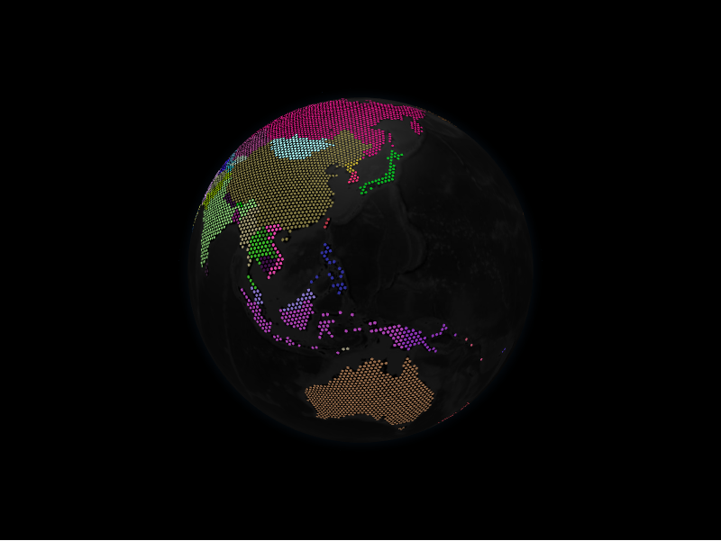

# Hexed Polygons Layer



The hexed polygons layer fills GeoJSON polygons with a grid of H3 hexagons,
giving a stylised, tiled look. Each `HexPolygonDatum` wraps a polygon geometry.

```python
from IPython.display import display
from geojson_pydantic import Polygon

from pyglobegl import (
    GlobeConfig,
    GlobeWidget,
    HexPolygonDatum,
    HexedPolygonsLayerConfig,
)

geometry = Polygon(
    type="Polygon",
    coordinates=[
        [(-10, 0), (-10, 10), (10, 10), (10, 0), (-10, 0)],
    ],
)

hexed = [
    HexPolygonDatum(geometry=geometry, color="#ffcc00", altitude=0.05),
]

config = GlobeConfig(
    hexed_polygons=HexedPolygonsLayerConfig(hex_polygons_data=hexed)
)

display(GlobeWidget(config=config))
```

## `HexPolygonDatum`

A hexed polygon carries its `geometry` plus appearance fields such as `color`,
`altitude`, and resolution/margin controls on `HexedPolygonsLayerConfig`.

!!! warning "Ring winding order"

    As with the [polygons layer](polygons.md), exterior rings must be
    counter-clockwise and holes clockwise. The GeoPandas helpers normalise this.

## Custom tooltip

`HexPolygonDatum.label` is each hexed polygon's hover tooltip. To compute one from
the datum or share a constant across the layer, set a layer-level
`hex_polygon_label` &mdash; a
[frontend Python callback](../guides/frontend-callbacks.md) (datum &rarr; string),
a plain string (one tooltip for all), or `None` (the default) to use each datum's
`label`. Swap it at runtime with `GlobeWidget.set_hex_polygon_label(...)`.

!!! tip "From a GeoDataFrame"

    `hexed_polygons_from_gdf` mirrors `polygons_from_gdf`, defaulting to a
    `polygons` geometry column. See [GeoPandas helpers](../integrations/geopandas.md).
