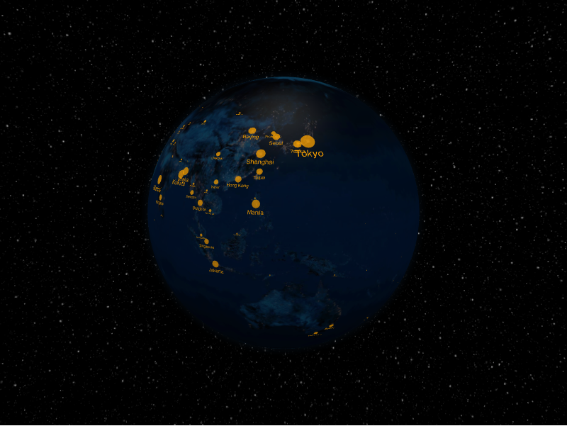

# Labels Layer



The labels layer places text labels (optionally with a marker dot) at
coordinates on the surface. Each label is a `LabelDatum`.

```python
from IPython.display import display

from pyglobegl import GlobeConfig, GlobeWidget, LabelDatum, LabelsLayerConfig

labels = [
    LabelDatum(lat=0, lng=0, text="Center", color="#ffcc00"),
    LabelDatum(lat=15, lng=20, text="North", color="#66ccff", include_dot=True),
]

config = GlobeConfig(labels=LabelsLayerConfig(labels_data=labels))

display(GlobeWidget(config=config))
```

## `LabelDatum`

A label carries `lat`, `lng`, `text`, and `color`, plus styling fields such as
`size`, `dot_radius`, `include_dot`, and `label_orientation`.

!!! tip "From a GeoDataFrame"

    `labels_from_gdf` builds labels from point geometries with a `text` column;
    pass extra columns through `include_columns=`. See
    [GeoPandas helpers](../integrations/geopandas.md).
