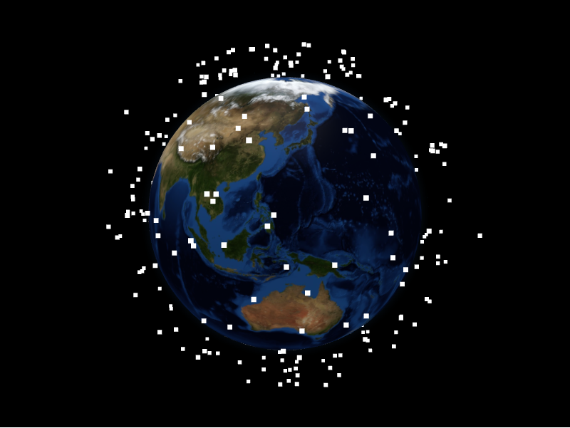

# Particles Layer



The particles layer renders dense clouds of lightweight points. Each
`ParticleDatum` is a group of `ParticlePointDatum` samples sharing a colour and
size.

```python
from IPython.display import display

from pyglobegl import (
    GlobeConfig,
    GlobeWidget,
    ParticleDatum,
    ParticlePointDatum,
    ParticlesLayerConfig,
)

particles = [
    ParticleDatum(
        particles=[
            ParticlePointDatum(lat=0, lng=0, altitude=0.2, label="Alpha"),
            ParticlePointDatum(lat=10, lng=10, altitude=0.2, label="Beta"),
        ],
        color="palegreen",
        size=2.0,
    )
]

config = GlobeConfig(particles=ParticlesLayerConfig(particles_data=particles))

display(GlobeWidget(config=config))
```

## `ParticleDatum` and `ParticlePointDatum`

- `ParticlePointDatum` &mdash; one particle with `lat`, `lng`, `altitude`, and
  `label`.
- `ParticleDatum` &mdash; a group of particles plus shared `color` and `size`.

## Custom tooltip

`ParticleDatum.label` is the particle group's hover tooltip. To compute one from
the datum or share a constant across the layer, set a layer-level `particle_label`
&mdash; a [frontend Python callback](../guides/frontend-callbacks.md)
(datum &rarr; string), a plain string (one tooltip for all), or `None` (the
default) to use each datum's `label`. Swap it at runtime with
`GlobeWidget.set_particle_label(...)`.

!!! tip "From a GeoDataFrame"

    `particles_from_gdf` builds a particle group from point geometries with an
    `altitude_column` and a shared `color`. See
    [GeoPandas helpers](../integrations/geopandas.md).
