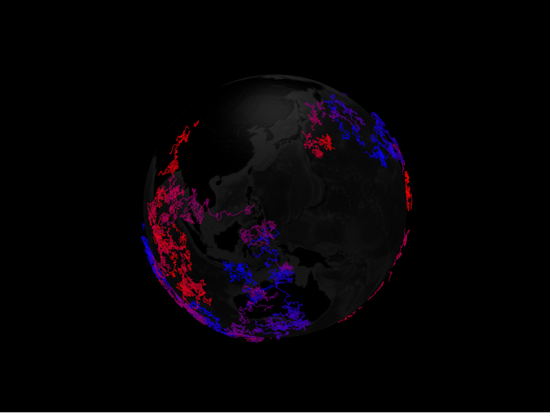

# Paths Layer



The paths layer draws a polyline that follows a sequence of coordinates along the
surface. Each line is a `PathDatum`.

```python
from IPython.display import display

from pyglobegl import GlobeConfig, GlobeWidget, PathDatum, PathsLayerConfig

paths = [
    PathDatum(path=[(0, 0), (5, 5), (10, 0)], color="#66ccff", dash_length=0.02),
]

config = GlobeConfig(
    paths=PathsLayerConfig(paths_data=paths, path_transition_duration=0),
)

display(GlobeWidget(config=config))
```

## `PathDatum`

A path is a list of `(lat, lng)` (or `(lat, lng, altitude)`) coordinates plus
appearance fields such as `color`, `stroke`, `dash_length`, `dash_gap`, and
`dash_animate_time`. Layer-level options like `path_transition_duration` live on
`PathsLayerConfig`.

## Custom gradient

`PathDatum.color` is a single colour or a list of discrete stops. For a continuous
gradient *along* each path, set a layer-level `path_color_fn` &mdash; a
[frontend Python callback](../guides/frontend-callbacks.md) mapping a position `t`
in `[0, 1]` (0 at the first vertex, 1 at the last) to a CSS colour string, typed
by the exported `ColorInterpolator` alias. When set it overrides the per-datum
colour for every path, and globe.gl samples it at data-change time.

```python
from pyglobegl import ColorInterpolator, frontend_python


@frontend_python
def gradient(t: float) -> str:  # ColorInterpolator: (t in [0, 1]) -> CSS colour
    red = int(255 * (1 - t))
    return f"rgb({red},30,{int(255 * t)})"


config = GlobeConfig(paths=PathsLayerConfig(paths_data=paths, path_color_fn=gradient))
```

Pass `None` (the default) to keep per-datum colours, or swap it at runtime with
`GlobeWidget.set_paths_color_fn(...)`.

!!! note "Thin lines only"

    The gradient interpolator applies to the default thin lines. Setting
    `path_stroke` switches globe.gl to fat lines, which support only the discrete
    colour-list form of `PathDatum.color`, not a `(t)`-interpolator.

## Custom tooltip

`PathDatum.label` is each path's hover tooltip. To compute one from the datum or
share a constant across the layer, set a layer-level `path_label` &mdash; a
[frontend Python callback](../guides/frontend-callbacks.md) (datum &rarr; string),
a plain string (one tooltip for every path), or `None` (the default) to use each
datum's `label`. Swap it at runtime with `GlobeWidget.set_path_label(...)`.

!!! tip "From a GeoDataFrame or trajectory"

    `paths_from_gdf` builds paths from `LineString` geometries, and
    `paths_from_mpd` builds them from MovingPandas trajectories. See
    [GeoPandas helpers](../integrations/geopandas.md) and
    [MovingPandas helpers](../integrations/movingpandas.md).
