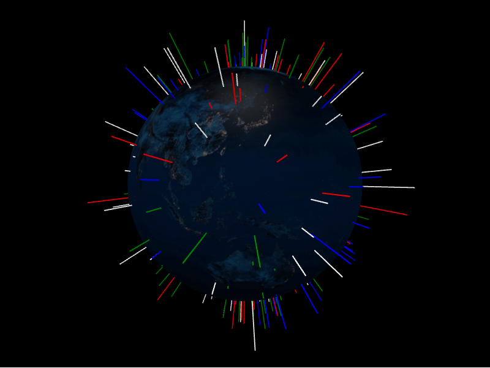

# Points Layer



The points layer renders one marker per `PointDatum`, positioned by latitude and
longitude and optionally extruded above the surface.

```python
from IPython.display import display

from pyglobegl import (
    GlobeConfig,
    GlobeLayerConfig,
    GlobeWidget,
    PointDatum,
    PointsLayerConfig,
)

points = [
    PointDatum(lat=0, lng=0, altitude=0.25, color="#ff0000", label="Center"),
    PointDatum(lat=15, lng=-45, altitude=0.12, color="#00ff00", label="West"),
]

config = GlobeConfig(
    globe=GlobeLayerConfig(
        globe_image_url="https://cdn.jsdelivr.net/npm/three-globe/example/img/earth-day.jpg"
    ),
    points=PointsLayerConfig(points_data=points),
)

display(GlobeWidget(config=config))
```

## `PointDatum`

Each point carries `lat`, `lng`, `altitude`, `color`, `radius`, and `label`
fields (with globe.gl defaults for anything you omit). Set `altitude` to raise the
marker above the surface, and `label` for the hover tooltip.

## Custom tooltip

`PointDatum.label` is each point's hover tooltip. To compute one from the datum or
share a constant across the layer, set a layer-level `point_label` &mdash; a
[frontend Python callback](../guides/frontend-callbacks.md) (datum &rarr; string),
a plain string (one tooltip for every point), or `None` (the default) to use each
datum's `label`. Swap it at runtime with `GlobeWidget.set_point_label(...)`.

!!! tip "From a GeoDataFrame"

    `points_from_gdf` builds `PointDatum` lists straight from a GeoDataFrame &mdash;
    see [GeoPandas helpers](../integrations/geopandas.md).

To update points after the widget renders, see
[Runtime updates & callbacks](../guides/runtime-updates.md).
