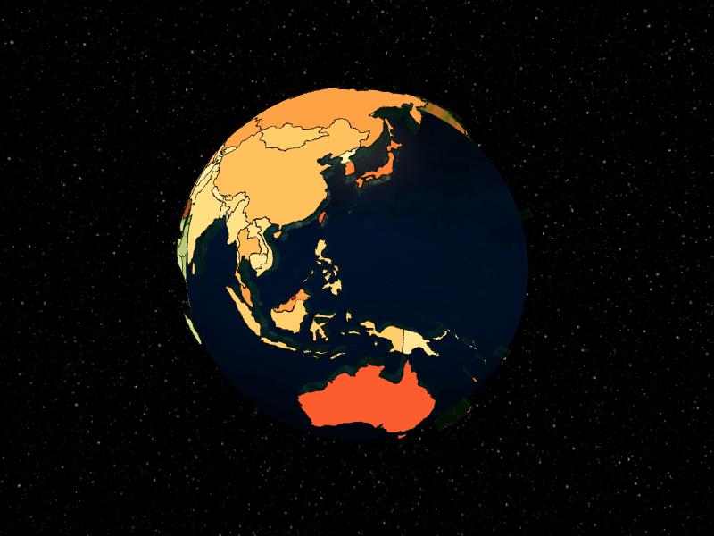

# Polygons Layer



The polygons layer extrudes GeoJSON polygons into 3D caps and sides. Geometry is
supplied as a [`geojson_pydantic.Polygon`](https://github.com/developmentseed/geojson-pydantic)
inside a `PolygonDatum`.

```python
from IPython.display import display
from geojson_pydantic import Polygon

from pyglobegl import (
    GlobeConfig,
    GlobeLayerConfig,
    GlobeWidget,
    PolygonDatum,
    PolygonsLayerConfig,
)

polygon = Polygon(
    type="Polygon",
    coordinates=[
        [
            (-10, 0),
            (-10, 10),
            (10, 10),
            (10, 0),
            (-10, 0),
        ]
    ],
)

config = GlobeConfig(
    globe=GlobeLayerConfig(
        globe_image_url="https://cdn.jsdelivr.net/npm/three-globe/example/img/earth-day.jpg"
    ),
    polygons=PolygonsLayerConfig(
        polygons_data=[
            PolygonDatum(geometry=polygon, cap_color="#ffcc00", altitude=0.05)
        ],
    ),
)

display(GlobeWidget(config=config))
```

## `PolygonDatum`

A polygon carries its `geometry` plus appearance fields such as `cap_color`,
`side_color`, `stroke_color`, and `altitude` (extrusion height).

!!! warning "Ring winding order"

    Exterior rings must be **counter-clockwise** (right-hand rule) so three.js cap
    triangulation renders correctly; holes should be **clockwise**. The GeoPandas
    helpers handle this for you.

!!! tip "From a GeoDataFrame"

    `polygons_from_gdf` defaults to a geometry column named `polygons` if present,
    otherwise the active geometry column. See
    [GeoPandas helpers](../integrations/geopandas.md).
