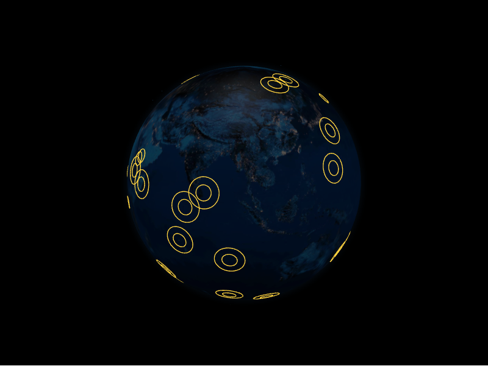

# Rings Layer



The rings layer animates expanding concentric rings outward from a coordinate,
useful for pings, pulses, or highlighting locations. Each ring is a `RingDatum`.

```python
from IPython.display import display

from pyglobegl import GlobeConfig, GlobeWidget, RingDatum, RingsLayerConfig

rings = [
    RingDatum(lat=0, lng=0, max_radius=4, color="#ff66cc"),
    RingDatum(lat=20, lng=10, max_radius=6, color="#66ccff"),
]

config = GlobeConfig(rings=RingsLayerConfig(rings_data=rings))

display(GlobeWidget(config=config))
```

## `RingDatum`

A ring is defined by `lat`, `lng`, `max_radius`, and `color`, with animation
controls (propagation speed, repeat period) available on `RingsLayerConfig`.

## Custom gradient

`RingDatum.color` is a single colour or a list of discrete stops. For a colour
that varies as each ring propagates, set a layer-level `ring_color_fn` &mdash; a
[frontend Python callback](../guides/frontend-callbacks.md) mapping the
propagation parameter `t` in `[0, 1]` (0 when the ring is emitted, 1 at its
`max_radius`) to a CSS colour string, typed by the exported `ColorInterpolator`
alias. When set it overrides the per-datum colour for every ring.

```python
from pyglobegl import ColorInterpolator, frontend_python


@frontend_python
def gradient(t: float) -> str:  # ColorInterpolator: (t in [0, 1]) -> CSS colour
    red = int(255 * (1 - t))
    return f"rgba({red},40,{int(255 * t)},{max(0.0, 1 - 0.6 * t)})"


config = GlobeConfig(rings=RingsLayerConfig(rings_data=rings, ring_color_fn=gradient))
```

Pass `None` (the default) to keep per-datum colours, or swap it at runtime with
`GlobeWidget.set_rings_color_fn(...)`.

!!! note "Sampled per frame"

    Unlike the arc/path gradients (baked once at data-change time), rings sample
    this callback once per ring per animation frame as they expand, so keep the
    body cheap. MicroPython throughput is ample for the handful of calls per frame
    this involves.

!!! tip "From a GeoDataFrame"

    `rings_from_gdf` builds rings from point geometries, carrying through columns
    such as `max_radius` and `color`. See
    [GeoPandas helpers](../integrations/geopandas.md).
