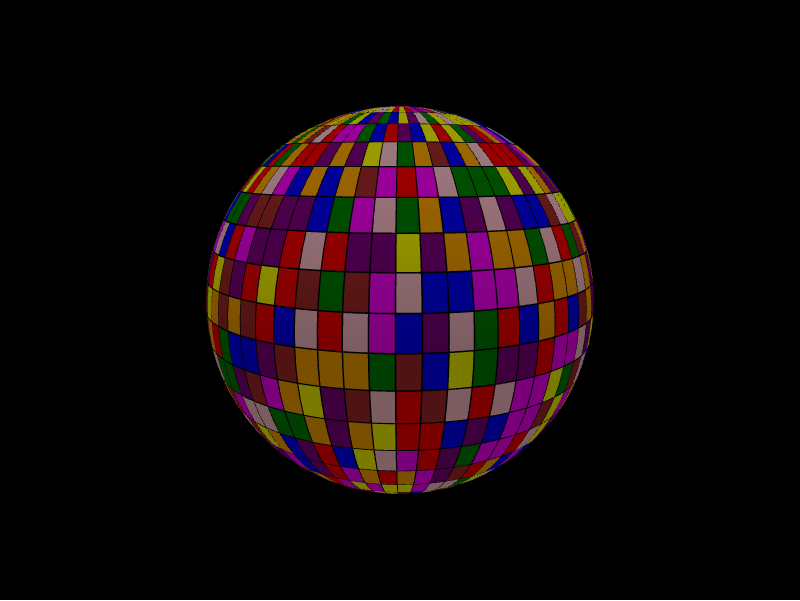

# Tiles Layer



The tiles layer places flat, rectangular tiles tangent to the surface, each with
its own three.js material. Each tile is a `TileDatum`, and materials are described
by `GlobeMaterialSpec`.

```python
from IPython.display import display

from pyglobegl import (
    GlobeConfig,
    GlobeMaterialSpec,
    GlobeWidget,
    TileDatum,
    TilesLayerConfig,
)

tiles = [
    TileDatum(
        lat=0,
        lng=0,
        width=10,
        height=10,
        material=GlobeMaterialSpec(
            type="MeshLambertMaterial",
            params={"color": "#66ccff", "opacity": 0.6, "transparent": True},
        ),
    )
]

config = GlobeConfig(tiles=TilesLayerConfig(tiles_data=tiles))

display(GlobeWidget(config=config))
```

## `TileDatum` and `GlobeMaterialSpec`

- `TileDatum` &mdash; `lat`, `lng`, `width`, `height` (in degrees), `altitude`,
  rotation, and a `material`.
- `GlobeMaterialSpec` &mdash; a three.js material `type` (for example
  `MeshLambertMaterial`) and a `params` dict forwarded to that material's
  constructor.

## Custom tooltip

`TileDatum.label` is each tile's hover tooltip. To compute one from the datum or
share a constant across the layer, set a layer-level `tile_label` &mdash; a
[frontend Python callback](../guides/frontend-callbacks.md) (datum &rarr; string),
a plain string (one tooltip for every tile), or `None` (the default) to use each
datum's `label`. Swap it at runtime with `GlobeWidget.set_tile_label(...)`.

!!! tip "From a GeoDataFrame"

    `tiles_from_gdf` builds tiles from point geometries with `width` / `height`
    columns. See [GeoPandas helpers](../integrations/geopandas.md).
